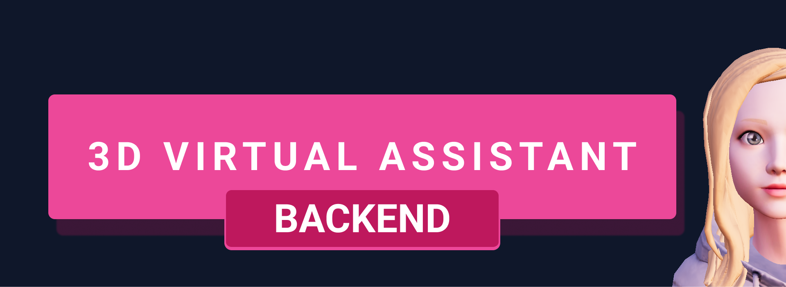

<div align="center">
  <h1 align="center">
    3D Virtual Assistent (Mobile)
    <br />
    <br />
      
  </h1>
</div>
<p align="center">
  
<p/>

## Table of Contents
  
* [Table of Contents](#table-of-contents)
* [Introduction](#introduction)
* [Setup](#setup)
* [Technologies Used](#technologies-used)

## Introduction

3D Virtual Assistent is a project to display a 3D charecter and have a conversation with. This project was built to serve as a study for the use of 3d models in React and React Native.<br>
The Backend version connects with ElevenLabs to use an AI voice and generete an audio file of the message recived, use a cross-platform solution to convert the audio file, so it may generate the lipsync json of the message text and return it to the frontend with the facial Expression, animation and playable audio.

**Tip**: This repository is the Backend version. If you wish to see the Mobile version [click here](https://github.com/DcWolfMc/3dVirtualAssistent-mobile)

## Setup
1. Create a `.env` file at the root of the repository to add your **ElevenLabs API Key**. Refer to `.env.example` for the environment variable names.
2. Install the **ffmpeg** in your pc correctly. Link to ffmpeg website [here](https://ffmpeg.org/).
3. Download the **RhubarbLibrary** binary for your **OS** [here](https://github.com/DanielSWolf/rhubarb-lip-sync/releases) and put it in your `bin` folder. `rhubarb` executable should be accessible through `bin/rhubarb`.

4. Finally, to start the development server use:
```
npm start
npm run dev
```

## Technologies Used
- Node.js
- Express
- Javascript
- Restfull API
- Elevenlabs
- OpenAI ***(To be implemented)***
